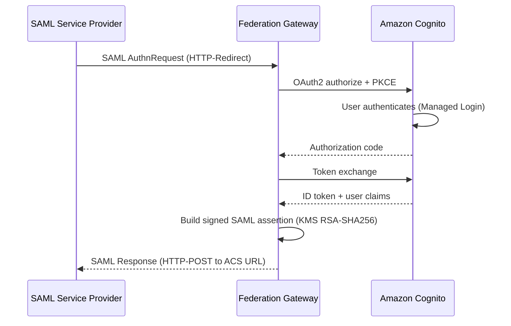
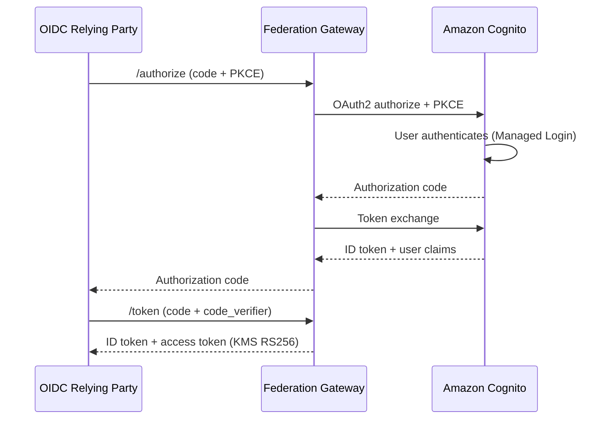
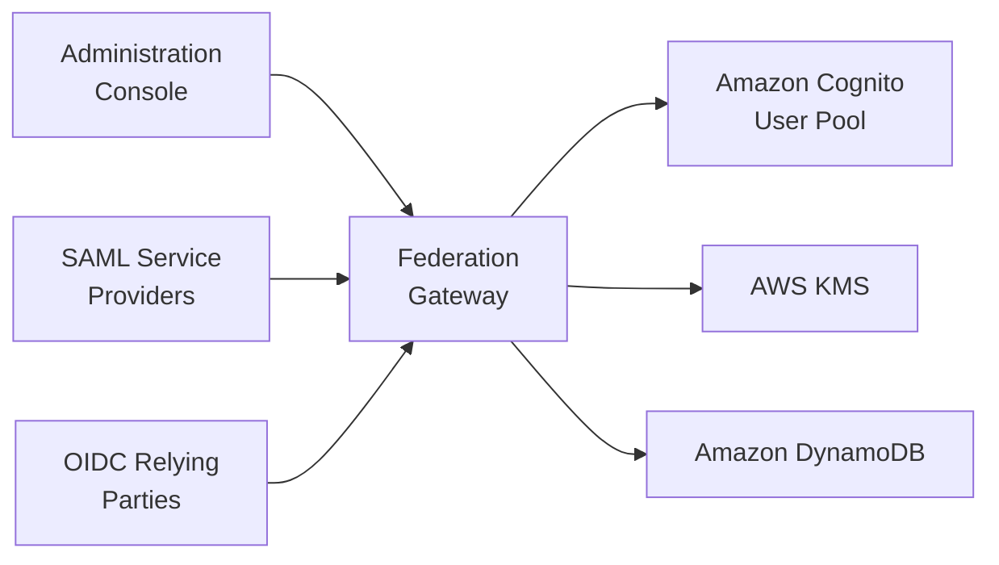
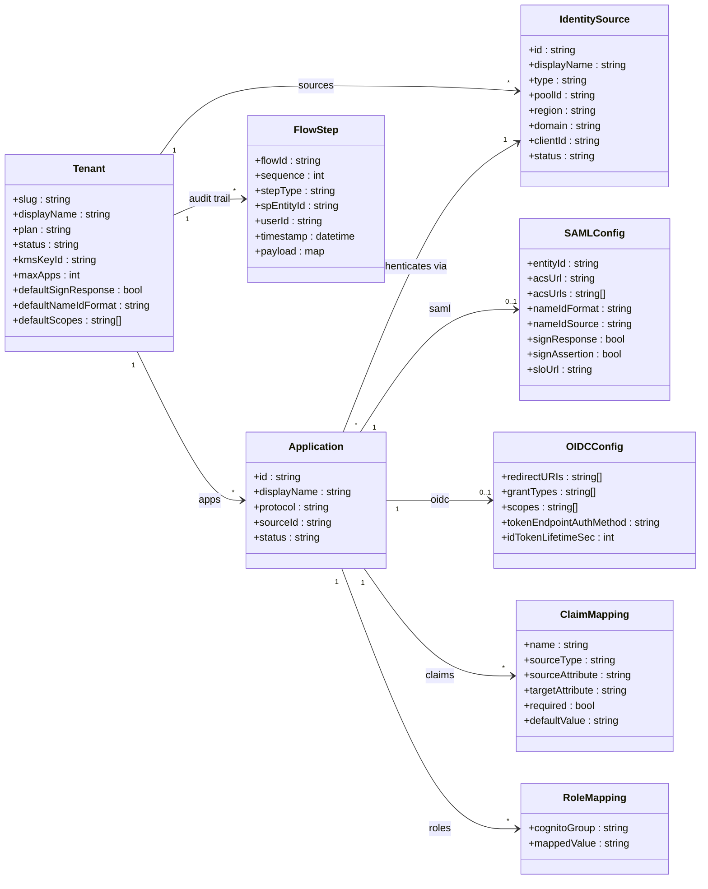

# Identity Federation Gateway

A multi-tenant serverless gateway that adds a SAML 2.0 Identity Provider (IdP) role and extends the native OpenID Connect 1.0 Provider capabilities of [Amazon Cognito](https://aws.amazon.com/cognito/) user pools — adding per-tenant issuers, per-application claim mappings, token introspection ([RFC 7662](https://datatracker.ietf.org/doc/html/rfc7662)), and cross-pool federation.

## Protocol support

### SAML 2.0 Identity Provider

Amazon Cognito acts as a SAML Service Provider — it consumes assertions but does not issue them. The gateway implements the SAML 2.0 Identity Provider role per the [OASIS SAML 2.0 Core specification](http://docs.oasis-open.org/security/saml/v2.0/saml-core-2.0-os.pdf), supporting the Web Browser SSO Profile with HTTP-Redirect and HTTP-POST bindings, `<AuthnRequest>` processing, signed `<Response>` and `<Assertion>` elements (RSA-SHA256), the `<EntityDescriptor>` metadata format per the [SAML 2.0 Metadata specification](http://docs.oasis-open.org/security/saml/v2.0/saml-metadata-2.0-os.pdf), and front-channel Single Logout via `<LogoutRequest>`/`<LogoutResponse>` with HTTP-Redirect binding per the [SAML 2.0 Profiles specification](http://docs.oasis-open.org/security/saml/v2.0/saml-profiles-2.0-os.pdf).

**Endpoints** (per tenant):

| Path | Description |
|------|-------------|
| `/t/{tenant}/saml/metadata` | IdP metadata (`<EntityDescriptor>`) |
| `/t/{tenant}/saml/metadata/{appId}` | Per-application IdP metadata |
| `/t/{tenant}/saml/sso` | Single Sign-On (HTTP-Redirect, HTTP-POST) |
| `/t/{tenant}/saml/slo` | Single Logout (HTTP-Redirect) |



| What the gateway provides | Amazon Cognito natively |
|---|---|
| Full SAML 2.0 IdP (SSO, SLO, metadata, assertions) | SAML Service Provider only — cannot issue assertions |
| Signed responses and assertions (RSA-SHA256 via AWS KMS) | — |
| Per-app ACS URLs, NameID formats, and claim mappings | — |
| Group-to-role mappings (Cognito group to SAML role value) | — |
| Per-app SAML metadata endpoint | — |
| AuthnRequest replay detection | — |
| Per-tenant KMS signing keys | — |
| Front-channel SLO (HTTP-Redirect) | — |

### OpenID Connect 1.0 Provider

Amazon Cognito user pools include a standards-compliant [OpenID Connect Core 1.0](https://openid.net/specs/openid-connect-core-1_0.html) Provider with a single issuer per pool and a fixed claim set. The gateway extends this with capabilities not available natively:



| What the gateway adds | What Amazon Cognito provides natively |
|---|---|
| Multi-tenant issuers (`/t/{tenant}/oidc`) | Single issuer per user pool |
| Declarative per-app claim mappings (config, not Lambda code) | Pre-token-generation Lambda trigger |
| Token introspection endpoint ([RFC 7662](https://datatracker.ietf.org/doc/html/rfc7662)) | — |
| Cross-pool federation (one gateway, multiple Cognito pools) | One pool per app client set |
| Per-tenant KMS signing keys | AWS-managed pool signing keys |
| Unified SAML + OIDC management API and UI | Separate console/API per protocol |
| Raw `cognito:groups` passed as `groups` claim | Same (`cognito:groups` in ID token) |

Both the gateway and Amazon Cognito support: PKCE (S256), public and confidential clients, per-app redirect URI validation, configurable token lifetimes, RS256 signing, discovery, JWKS, UserInfo, and token revocation.

**Endpoints** (per tenant):

| Path | Description |
|------|-------------|
| `/t/{tenant}/oidc/.well-known/openid-configuration` | [OpenID Connect Discovery 1.0](https://openid.net/specs/openid-connect-discovery-1_0.html) |
| `/t/{tenant}/oidc/authorize` | Authorization endpoint ([RFC 6749](https://datatracker.ietf.org/doc/html/rfc6749)) |
| `/t/{tenant}/oidc/oauth/token` | Token endpoint |
| `/t/{tenant}/oidc/oauth/introspect` | Token introspection ([RFC 7662](https://datatracker.ietf.org/doc/html/rfc7662)) |
| `/t/{tenant}/oidc/userinfo` | UserInfo endpoint ([OpenID Connect Core 1.0 &sect;5.3](https://openid.net/specs/openid-connect-core-1_0.html#UserInfo)) |
| `/t/{tenant}/oidc/keys` | JSON Web Key Set ([RFC 7517](https://datatracker.ietf.org/doc/html/rfc7517)) |
| `/t/{tenant}/oidc/revoke` | Token revocation ([RFC 7009](https://datatracker.ietf.org/doc/html/rfc7009)) |
| `/t/{tenant}/oidc/end_session` | RP-Initiated Logout ([OpenID Connect RP-Initiated Logout 1.0](https://openid.net/specs/openid-connect-rpinitiated-1_0.html)) |

## Architecture



For a full AWS deployment view — every component, cluster, and request path — see the
[Deployment Architecture](docs/architecture_readme.md).

### Data model

All entities share a single Amazon DynamoDB table using composite keys (`PK`, `SK`) with two GSIs for entity ID lookup and user flow queries.



**DynamoDB key design:**

| Entity | PK | SK |
|--------|----|----|
| Tenant config | `TENANT#{slug}` | `CONFIG` |
| Identity source | `TENANT#{slug}` | `SOURCE#{id}` |
| Application | `TENANT#{slug}` | `APP#{id}` |
| SAML config | `TENANT#{slug}` | `APP#{id}#SAML` |
| OIDC config | `TENANT#{slug}` | `APP#{id}#OIDC` |
| Claim mapping | `TENANT#{slug}` | `APP#{id}#CLAIM#{name}` |
| Role mapping | `TENANT#{slug}` | `APP#{id}#ROLE#{group}` |
| Audit step | `FLOW#{flowId}` | `STEP#{sequence}` |
| Replay guard | `REPLAY#{requestId}` | `_` |
| Access token | `OIDC#TOKEN` | `ACCESS#{hash}` |
| Signing cert | `SYSTEM#CONFIG` | `SYSTEM#SIGNING_CERT` |

The gateway runs on [AWS Lambda](https://aws.amazon.com/lambda/) (ARM64) behind [Amazon CloudFront](https://aws.amazon.com/cloudfront/) with [AWS WAF](https://aws.amazon.com/waf/). Assertions and tokens are signed with [AWS Key Management Service (KMS)](https://aws.amazon.com/kms/). Tenant and application configuration is stored in [Amazon DynamoDB](https://aws.amazon.com/dynamodb/). The administration console is a React/TypeScript single-page application served from [Amazon Simple Storage Service (Amazon S3)](https://aws.amazon.com/s3/), with Amazon Cognito authentication.

## Quick start deployment

> **New to this project or deploying into a fresh AWS account?** Follow the
> [Quickstart: provision a new AWS account with Terraform](docs/QUICKSTART.md)
> for an end-to-end walkthrough (prerequisites, first-time Terraform apply,
> Lambda image bootstrap, and post-install configuration).

```bash
make run-local      # Gateway on :8080 (in-memory store, mock KMS)
make test-sp        # SAML SP demo on :8081
make test-rp        # OIDC RP demo on :8082
```

### Deploy to AWS

```bash
make tf-init        # Initialize Terraform backend
make deploy-dev     # Build, push, terraform apply, sync frontend
```

## Build commands

| Command | Description |
|---------|-------------|
| `make build` | Build Go binary (linux/arm64) |
| `make test` | Run unit tests |
| `make test-e2e` | Run E2E tests |
| `make lint` | Run golangci-lint and tflint |
| `make deploy-dev` | Full deploy pipeline |
| `make frontend-dev` | Frontend dev server on :3000 |
| `make frontend-deploy` | Build the console, sync to S3, and invalidate CloudFront |

## Security

Management API endpoints require Amazon Cognito JWT authentication at the [Amazon API Gateway](https://aws.amazon.com/api-gateway/) layer. SAML assertions signed with RSA-SHA256 and OIDC tokens with RS256, both through AWS KMS. Cookie encryption uses AES-256-GCM with HMAC-SHA256 using separately derived keys. CSRF protection via OAuth2 state parameters and PKCE. AuthnRequest replay detection. AWS WAF with OWASP Core Rule Set and endpoint-specific rate limiting. Admin-only user creation in the Amazon Cognito user pool.

## Technologies

- **Go 1.26** with [crewjam/saml](https://github.com/crewjam/saml) v0.5, [zitadel/oidc](https://github.com/zitadel/oidc) v3, [Huma](https://github.com/danielgtaylor/huma) v2, [guregu/dynamo](https://github.com/guregu/dynamo) v2
- **React 18** with [Cloudscape Design System](https://cloudscape.design) v3 and TanStack Query v5
- **Terraform** with [terraform-aws-modules](https://github.com/terraform-aws-modules)

## License

This project is provided as a sample implementation. See [LICENSE](LICENSE) for details.

## Cost estimate

The stack is serverless and scales to near-zero when idle — the only meaningful
fixed cost is AWS WAF. The table below is a rough monthly estimate for an idle to
light-traffic **dev** deployment in `eu-north-1` with the default variables
(no custom domain). Traffic-driven services (Lambda, API Gateway, CloudFront,
DynamoDB) stay within or near the free tier at low volume and scale with usage.

| Service | What is provisioned | Est. monthly (USD) |
|---------|---------------------|--------------------|
| AWS WAF | 2 web ACLs (CloudFront + regional), ~6 rules each (3 AWS managed rule groups + 3 rate-based) | ~$22 |
| AWS KMS | 3 CMKs (2× RSA-2048 SAML signing, 1× symmetric encryption) | ~$3 |
| CloudWatch Logs | ~6 log groups, 365-day retention (low ingest) | ~$1–3 |
| AWS Secrets Manager | 2 secrets (edge secret, OIDC crypto key) | ~$1 |
| Amazon ECR | 10 repositories, arm64 images (~2–3 GB stored) | ~$0.30 |
| Amazon API Gateway | 3 HTTP APIs, pay-per-request | ~$0–1 |
| Amazon CloudFront | 3 distributions, pay-per-use | ~$0–1 |
| Amazon DynamoDB | 2 on-demand tables | ~$0–1 |
| AWS Lambda | 10 functions (arm64), pay-per-request | ~$0 (free tier) |
| Amazon Cognito | 1 user pool | ~$0 (≤50k MAU free) |
| Amazon Route 53 | hosted zone (only if `custom_domain` is set) | $0 (default off) |
| **Baseline (idle)** | | **~$28–35 / month** |

> These figures are a rough estimate derived from the resources in `infra/`, not
> a live pricing run. Actual cost varies by region, traffic, and variable
> overrides. WAF (~$22/mo) dominates the fixed cost; deleting the unassociated
> regional web ACL roughly halves the WAF line if you do not plan to bind it.

### Generate a precise estimate with Infracost

[Infracost](https://github.com/infracost/infracost) produces an authoritative,
region-accurate breakdown from the Terraform itself. A repo-level
[`infracost.yml`](infracost.yml) is included that covers all three stacks:

```bash
# One-time: install the CLI and get a free API key
brew install infracost         # or see https://www.infracost.io/docs
infracost auth login

# Combined monthly estimate across registry + gateway + demo
infracost breakdown --config-file infracost.yml
```

This uses the same `env/dev.tfvars` as `make deploy-dev`, so the estimate tracks
your actual variable values.
