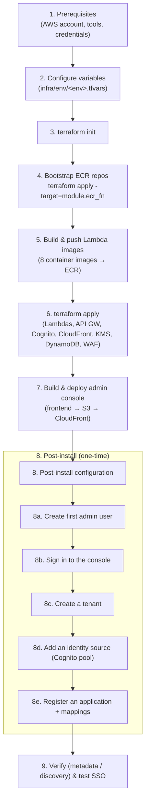

# Quickstart: deploy to a new AWS account

This guide walks a new customer through provisioning the Identity Federation Gateway
from scratch with Terraform, then completing the post-install configuration to sign in
and federate a first application.

> Time: ~30–45 minutes (most of it CloudFront provisioning). Everything is created in
> **one AWS account/region** and can be torn down with a single `terraform destroy`.

## High-level steps



---

## 1. Prerequisites

- An **AWS account** and credentials configured for the AWS CLI (a named profile or `default`).
  The deploying principal needs permissions to create IAM, Lambda, ECR, API Gateway, Cognito,
  CloudFront, WAF, KMS, DynamoDB, S3, SNS, and CloudWatch resources.
- **Tools:**
  - [Terraform](https://developer.hashicorp.com/terraform/downloads) `>= 1.7`
  - [Go](https://go.dev/dl/) `1.26+`
  - [Docker](https://docs.docker.com/get-docker/) with **buildx** (the Lambdas are arm64 container images)
  - [Node.js](https://nodejs.org/) `18+` (admin console build)
  - [AWS CLI v2](https://docs.aws.amazon.com/cli/latest/userguide/getting-started-install.html)
- Clone the repo and set a couple of shell variables used throughout:

```bash
git clone <this-repo> && cd <this-repo>
export AWS_PROFILE=default          # your AWS CLI profile
export AWS_REGION=us-east-1         # the region you will deploy to
export ENV=dev                      # environment name: dev | staging | prod
```

> **State backend:** the Terraform config uses a **local** backend by default
> (`infra/versions.tf` → `backend "local" {}`), so state is stored on your machine — no
> S3 bucket required to get started. For team/production use, configure an S3 backend (see
> [Remote state](#remote-state-optional)).

## 2. Configure variables

Create your variables file from the dev example and edit the required values:

```bash
cp infra/env/dev.tfvars infra/env/$ENV.tfvars
```

Set these (only the first four are **required** — the rest have sensible defaults):

```hcl
environment    = "dev"                              # must match $ENV
owner          = "you@example.com"                  # tag value
aws_region     = "us-east-1"                        # must match $AWS_REGION
alert_email    = "ops@example.com"                  # operational alerts (SNS)
saml_entity_id = "https://gateway.example.com"      # the IdP entity ID this gateway advertises

# Leave these EMPTY for a first deploy (uses the default CloudFront + API Gateway URLs).
# Set them later if you want a custom domain via Route 53 + ACM.
custom_domain  = ""
dns_zone_name  = ""

# Leave empty unless you specifically need them:
additional_tags        = {}     # provider default_tags (customers normally omit)
ses_from_email_address = ""      # empty = use Cognito's default email sender
```

> If you don't have a custom domain, leave `custom_domain` and `dns_zone_name` empty — the
> gateway is reachable at the generated CloudFront domain, which you'll get from a Terraform
> output in step 7.

## 3. Initialize Terraform

```bash
cd infra
terraform init
cd ..
```

## 4. Bootstrap the ECR repositories

The gateway runs as **8 container-image Lambdas**, and Terraform both creates their ECR
repositories *and* defines the functions that pull `:latest` from them. On a brand-new
account the images don't exist yet, so create the repositories first:

```bash
cd infra
terraform apply -var-file=env/$ENV.tfvars -target=module.ecr_fn
cd ..
```

This creates one repository per function: `cognito-saml-proxy-$ENV-<function>`.

## 5. Build and push the Lambda images

Build all 8 arm64 binaries, then push each as a container image to its ECR repo.

```bash
# Build the binaries (into ./bin)
make build-all-lambdas

# Log in to ECR
ACCOUNT=$(aws sts get-caller-identity --query Account --output text)
aws ecr get-login-password --region "$AWS_REGION" \
  | docker login --username AWS --password-stdin "$ACCOUNT.dkr.ecr.$AWS_REGION.amazonaws.com"

# Build + push each function image (build context is ./bin)
for fn in saml-sso saml-slo saml-metadata oidc-authorize oidc-token oidc-discovery management-api health; do
  docker buildx build --platform linux/arm64 --provenance=false \
    -f "cmd/$fn/Dockerfile" \
    -t "$ACCOUNT.dkr.ecr.$AWS_REGION.amazonaws.com/cognito-saml-proxy-$ENV-$fn:latest" \
    --push ./bin
done
```

> **Important — `--provenance=false`:** Docker buildx attaches an attestation/provenance
> manifest list by default, which AWS Lambda **rejects** ("source image is not valid").
> Always pass `--provenance=false` for Lambda container images.

## 6. Deploy the gateway

Now apply the full configuration. Lambdas will find their images in ECR:

```bash
cd infra
terraform apply -var-file=env/$ENV.tfvars
cd ..
```

This provisions the Lambdas, API Gateway, Cognito user pool (+ `Admins`/`Operators`
groups), DynamoDB tables, KMS signing/encryption keys, the S3 + CloudFront admin console
hosting, and the WAF. CloudFront takes several minutes to deploy.

## 7. Build and deploy the admin console

The console is a static SPA configured at build time from Terraform outputs:

```bash
make frontend-build        # reads cognito_* outputs and builds frontend/dist

ACCOUNT=$(aws sts get-caller-identity --query Account --output text)
aws s3 sync frontend/dist/ "s3://cognito-saml-proxy-$ENV-frontend-$ACCOUNT" --delete --region "$AWS_REGION"
aws cloudfront create-invalidation \
  --distribution-id "$(cd infra && terraform output -raw cloudfront_distribution_id)" \
  --paths "/*" --region "$AWS_REGION"
```

Get your console URL:

```bash
cd infra && terraform output -raw cloudfront_domain_name && cd ..
# -> https://dxxxxxxxxxxxxx.cloudfront.net   (or your custom_domain if you set one)
```

---

## 8. Post-install configuration

Terraform does **not** seed an admin user or a tenant — you create the first ones here.

### 8a. Create your first admin user

The Cognito pool is admin-create-only, so create the user via the CLI, give it a permanent
password (no email needed), set its tenant, and add it to the `Admins` group. Pick a tenant
slug now (e.g. `acme`) — it must match the tenant you create in 8c.

```bash
POOL=$(cd infra && terraform output -raw cognito_user_pool_id)
ADMIN_EMAIL="admin@example.com"
TENANT_SLUG="acme"

aws cognito-idp admin-create-user --user-pool-id "$POOL" --username "$ADMIN_EMAIL" \
  --message-action SUPPRESS --region "$AWS_REGION" \
  --user-attributes Name=email,Value="$ADMIN_EMAIL" Name=email_verified,Value=true \
                    Name=custom:tenant_id,Value="$TENANT_SLUG"

aws cognito-idp admin-set-user-password --user-pool-id "$POOL" --username "$ADMIN_EMAIL" \
  --password 'ChangeMe!Strong1' --permanent --region "$AWS_REGION"

aws cognito-idp admin-add-user-to-group --user-pool-id "$POOL" --username "$ADMIN_EMAIL" \
  --group-name Admins --region "$AWS_REGION"
```

> RBAC: `Admins` can read **and** write; `Operators` is read-only. The console scopes you to
> the tenant in your `custom:tenant_id` claim.

### 8b. Sign in to the console

Open the CloudFront URL from step 7, sign in with the admin email + password above. (The
console authenticates against the gateway's Cognito pool via the hosted UI.)

### 8c. Create a tenant

Create a tenant whose **slug matches** the `custom:tenant_id` you set (`acme`). You can do
this from the console's tenant management, or via the API:

```bash
API=$(cd infra && terraform output -raw api_endpoint)
# Obtain an admin access token (e.g. via the console session) and:
curl -X POST "$API/api/v1/tenants" -H "Authorization: Bearer <ADMIN_ID_TOKEN>" \
  -H "Content-Type: application/json" \
  -d '{"slug":"acme","displayName":"Acme Corp"}'
```

### 8d. Add an identity source

In the console: **Identity Sources → Add source**. An identity source is the Cognito user
pool that authenticates your *end users*. For a quick test you can point it at the gateway's
own pool; in production use a dedicated end-user pool. Supply its pool ID, region, app
client ID (public, with `ALLOW_USER_SRP_AUTH` + `ALLOW_REFRESH_TOKEN_AUTH`), and hosted-UI
domain. (Each section has an **Info** link explaining the fields.)

### 8e. Register an application

In the console: **Applications → Register new**. Choose SAML or OIDC, bind the identity
source, and configure endpoints, claim/role mappings, and (optionally) a custom login page.
The **Integration** tab then gives you the metadata URL / discovery URL and certificate to
hand to the relying party.

---

## 9. Verify

```bash
BASE=$(cd infra && terraform output -raw cloudfront_domain_name)   # or your custom domain

# SAML IdP metadata for your tenant
curl -s "$BASE/t/acme/saml/metadata" | head

# OIDC discovery for your tenant
curl -s "$BASE/t/acme/oidc/.well-known/openid-configuration" | jq .
```

Then run an end-to-end SSO from your application (or the optional demo apps below).

### Optional: the Custom UI demo

A standalone React demo that shows building your own login UI against the gateway lives in
[`examples/custom-ui`](../examples/custom-ui/README.md) — deploy it separately (S3 +
CloudFront) to exercise login, registration, password reset, token refresh, and the
IdP-initiated app launcher.

---

## Remote state (optional)

For shared/team use, store Terraform state in S3 instead of locally:

1. Create a state bucket (one-time): `aws s3 mb s3://my-tfstate-bucket --region $AWS_REGION`.
2. Create `infra/env/$ENV.backend.hcl`:
   ```hcl
   bucket = "my-tfstate-bucket"
   key    = "cognito-saml-proxy/dev/terraform.tfstate"
   ```
3. Change `infra/versions.tf` `backend "local" {}` to `backend "s3" {}`, then
   `terraform init -backend-config=env/$ENV.backend.hcl -migrate-state`.

## Teardown

```bash
cd infra
terraform destroy -var-file=env/$ENV.tfvars
```

> ECR repos use `force_delete` in non-prod, so images are removed automatically. If a WAF
> web ACL is slow to delete because CloudFront is still disassociating, re-run `destroy` a
> few minutes later.

## Troubleshooting

| Symptom | Cause / Fix |
|---------|-------------|
| `terraform apply` fails creating a Lambda: *source image does not exist* | You skipped the bootstrap. Run step 4 (ECR), step 5 (push images), then step 6. |
| Lambda update fails: *source image is not valid* / manifest error | The image was built without `--provenance=false`. Rebuild/push with that flag (step 5). |
| Console loads but API calls 401/403 | Your user isn't in `Admins`/`Operators`, or its `custom:tenant_id` doesn't match an existing tenant (8a/8c). |
| Cognito sign-up/reset emails never arrive | New accounts have SES in sandbox. For admin login this is fine (we set the password directly in 8a). Verify an SES identity and set `ses_from_email_address` for real email. |
| `enable_public_iac_templates` apply error | Leave it `false` in accounts that enforce S3 Block Public Access. |
