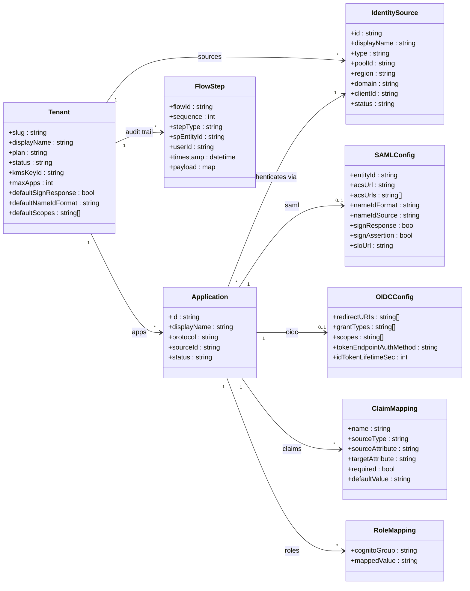

# Data model

All entities share a single Amazon DynamoDB table using composite keys (`PK`, `SK`) with
two GSIs for entity ID lookup and user-flow queries.

## DynamoDB key design

| Entity | PK | SK |
|--------|----|----|
| Tenant config | `TENANT#{slug}` | `CONFIG` |
| Identity source | `TENANT#{slug}` | `SOURCE#{id}` |
| Application | `TENANT#{slug}` | `APP#{id}` |
| SAML config | `TENANT#{slug}` | `APP#{id}#SAML` |
| OIDC config | `TENANT#{slug}` | `APP#{id}#OIDC` |
| Claim mapping | `TENANT#{slug}` | `APP#{id}#CLAIM#{name}` |
| Role mapping | `TENANT#{slug}` | `APP#{id}#ROLE#{group}` |
| Audit step | `FLOW#{flowId}` | `STEP#{sequence}` |
| Replay guard | `REPLAY#{requestId}` | `_` |
| Access token | `OIDC#TOKEN` | `ACCESS#{hash}` |
| Signing cert | `SYSTEM#CONFIG` | `SYSTEM#SIGNING_CERT` |

The config table is encrypted at rest with the symmetric KMS encryption key. A second
DynamoDB table holds short-lived flow/session state, expired automatically via DynamoDB TTL.
