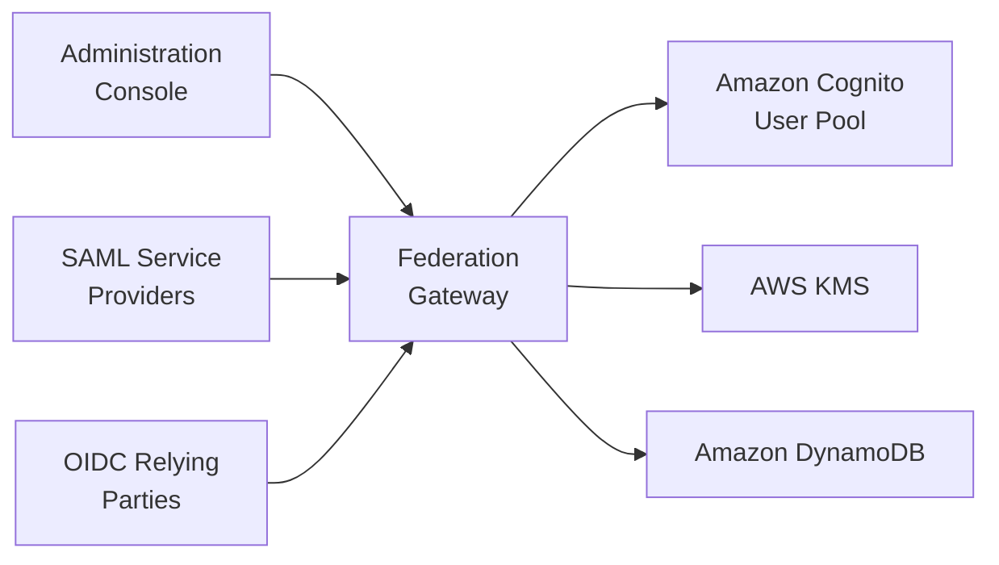

# Introduction

The **Identity Federation Gateway** is a multi-tenant, serverless gateway that adds a
SAML 2.0 Identity Provider (IdP) role and extends the native OpenID Connect 1.0 Provider
capabilities of [Amazon Cognito](https://aws.amazon.com/cognito/) user pools — adding
per-tenant issuers, per-application claim mappings, token introspection
([RFC 7662](https://datatracker.ietf.org/doc/html/rfc7662)), and cross-pool federation.

## The problem it solves

Amazon Cognito is a capable OIDC provider, but it has two gaps that this gateway fills:

1. **No SAML IdP.** Cognito can *consume* SAML (as a Service Provider) but cannot *issue*
   SAML assertions. Applications that only speak SAML 2.0 cannot federate against Cognito
   directly.
2. **Single-tenant, fixed OIDC.** Each Cognito pool has one OIDC issuer and a fixed claim
   set. Multi-tenant SaaS platforms, per-application claim shaping, and token introspection
   require custom work.

The gateway sits in front of one or more Cognito user pools and presents standards-compliant
**SAML 2.0** and **OpenID Connect 1.0** endpoints per tenant, with configuration-driven claim
and role mapping — no per-application Lambda code.

## High-level architecture

The gateway runs on [AWS Lambda](https://aws.amazon.com/lambda/) (ARM64) behind
[Amazon CloudFront](https://aws.amazon.com/cloudfront/) with [AWS WAF](https://aws.amazon.com/waf/).
Assertions and tokens are signed with [AWS KMS](https://aws.amazon.com/kms/). Tenant and
application configuration is stored in [Amazon DynamoDB](https://aws.amazon.com/dynamodb/).
The administration console is a React/TypeScript single-page application served from
[Amazon S3](https://aws.amazon.com/s3/), authenticated with Amazon Cognito.

For the full component-level view, see [Architecture](architecture.md). For how data is
stored, see the [Data model](data-model.md). Dive into each protocol in
[SAML 2.0](../protocols/saml.md) and [OpenID Connect](../protocols/oidc.md).

## When to use it

- You have SAML-only applications that must federate against Amazon Cognito users.
- You are building a multi-tenant SaaS and need per-tenant OIDC issuers.
- You need per-application claim/role mapping without writing and maintaining Lambda
  pre-token-generation triggers.
- You want a single management surface (API + console) for both SAML and OIDC apps.
