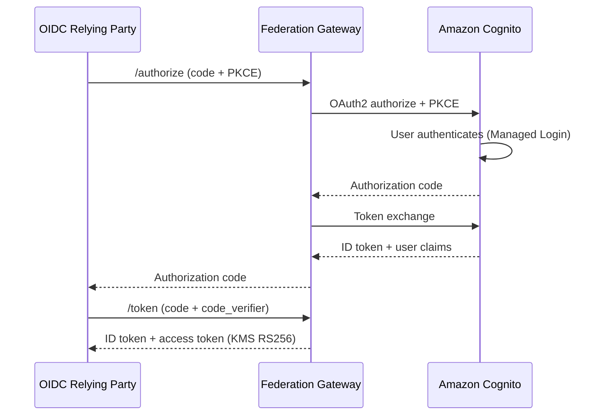

# OpenID Connect 1.0 Provider

Amazon Cognito user pools include a standards-compliant
[OpenID Connect Core 1.0](https://openid.net/specs/openid-connect-core-1_0.html) Provider
with a single issuer per pool and a fixed claim set. The Identity Federation Gateway
extends this with capabilities not available natively.

## Authorization code flow

## What the gateway adds over native Cognito

| What the gateway adds | What Amazon Cognito provides natively |
|---|---|
| Multi-tenant issuers (`/t/{tenant}/oidc`) | Single issuer per user pool |
| Declarative per-app claim mappings (config, not Lambda code) | Pre-token-generation Lambda trigger |
| Token introspection endpoint ([RFC 7662](https://datatracker.ietf.org/doc/html/rfc7662)) | — |
| Cross-pool federation (one gateway, multiple Cognito pools) | One pool per app client set |
| Per-tenant KMS signing keys | AWS-managed pool signing keys |
| Unified SAML + OIDC management API and UI | Separate console/API per protocol |
| Raw `cognito:groups` passed as `groups` claim | Same (`cognito:groups` in ID token) |

Both the gateway and Amazon Cognito support: PKCE (S256), public and confidential clients,
per-app redirect URI validation, configurable token lifetimes, RS256 signing, discovery,
JWKS, UserInfo, and token revocation.

## Endpoints (per tenant)

| Path | Description |
|------|-------------|
| `/t/{tenant}/oidc/.well-known/openid-configuration` | [OpenID Connect Discovery 1.0](https://openid.net/specs/openid-connect-discovery-1_0.html) |
| `/t/{tenant}/oidc/authorize` | Authorization endpoint ([RFC 6749](https://datatracker.ietf.org/doc/html/rfc6749)) |
| `/t/{tenant}/oidc/oauth/token` | Token endpoint |
| `/t/{tenant}/oidc/oauth/introspect` | Token introspection ([RFC 7662](https://datatracker.ietf.org/doc/html/rfc7662)) |
| `/t/{tenant}/oidc/userinfo` | UserInfo endpoint ([OpenID Connect Core 1.0 §5.3](https://openid.net/specs/openid-connect-core-1_0.html#UserInfo)) |
| `/t/{tenant}/oidc/keys` | JSON Web Key Set ([RFC 7517](https://datatracker.ietf.org/doc/html/rfc7517)) |
| `/t/{tenant}/oidc/revoke` | Token revocation ([RFC 7009](https://datatracker.ietf.org/doc/html/rfc7009)) |
| `/t/{tenant}/oidc/end_session` | RP-Initiated Logout ([OpenID Connect RP-Initiated Logout 1.0](https://openid.net/specs/openid-connect-rpinitiated-1_0.html)) |
