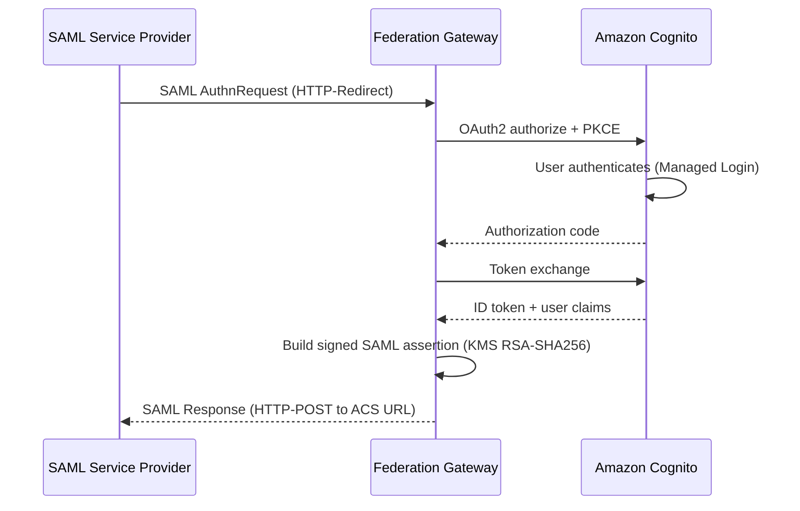

# SAML 2.0 Identity Provider

Amazon Cognito acts as a SAML **Service Provider** — it consumes assertions but does not
issue them. The Identity Federation Gateway implements the SAML 2.0 **Identity Provider**
role per the [OASIS SAML 2.0 Core specification](http://docs.oasis-open.org/security/saml/v2.0/saml-core-2.0-os.pdf),
supporting:

- The Web Browser SSO Profile with **HTTP-Redirect** and **HTTP-POST** bindings
- `<AuthnRequest>` processing
- Signed `<Response>` and `<Assertion>` elements (RSA-SHA256, via AWS KMS)
- `<EntityDescriptor>` metadata per the [SAML 2.0 Metadata specification](http://docs.oasis-open.org/security/saml/v2.0/saml-metadata-2.0-os.pdf)
- Front-channel Single Logout via `<LogoutRequest>` / `<LogoutResponse>` (HTTP-Redirect
  binding) per the [SAML 2.0 Profiles specification](http://docs.oasis-open.org/security/saml/v2.0/saml-profiles-2.0-os.pdf)

## Single sign-on flow

## What the gateway adds over native Cognito

| What the gateway provides | Amazon Cognito natively |
|---|---|
| Full SAML 2.0 IdP (SSO, SLO, metadata, assertions) | SAML Service Provider only — cannot issue assertions |
| Signed responses and assertions (RSA-SHA256 via AWS KMS) | — |
| Per-app ACS URLs, NameID formats, and claim mappings | — |
| Group-to-role mappings (Cognito group to SAML role value) | — |
| Per-app SAML metadata endpoint | — |
| AuthnRequest replay detection | — |
| Per-tenant KMS signing keys | — |
| Front-channel SLO (HTTP-Redirect) | — |

## Endpoints (per tenant)

| Path | Description |
|------|-------------|
| `/t/{tenant}/saml/metadata` | IdP metadata (`<EntityDescriptor>`) |
| `/t/{tenant}/saml/metadata/{appId}` | Per-application IdP metadata |
| `/t/{tenant}/saml/sso` | Single Sign-On (HTTP-Redirect, HTTP-POST) |
| `/t/{tenant}/saml/slo` | Single Logout (HTTP-Redirect) |
