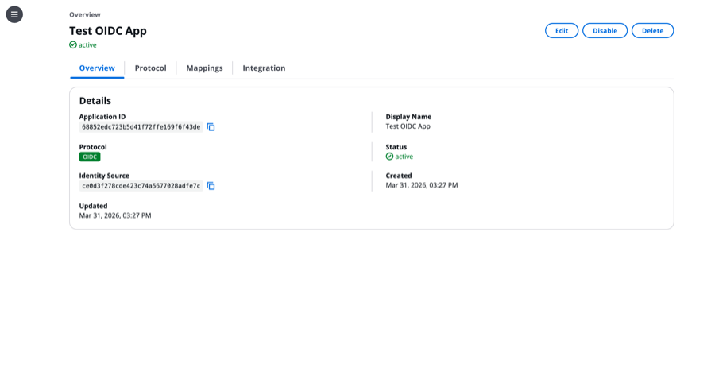
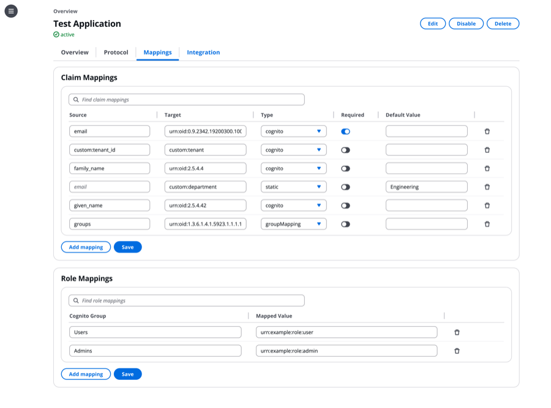
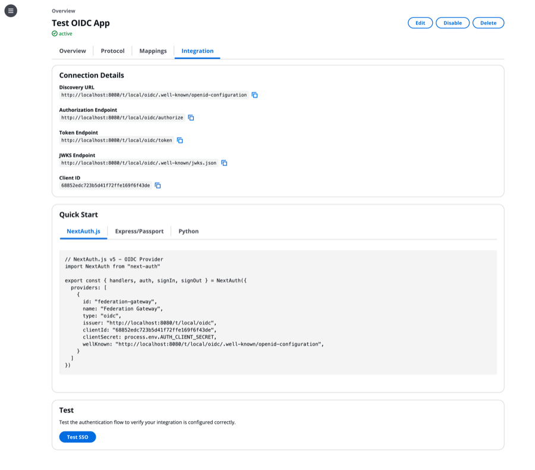

# Administration Console

React/TypeScript single-page application for managing the Identity Federation Gateway. Built with [Cloudscape Design System](https://cloudscape.design) v3 and [TanStack Query](https://tanstack.com/query) v5.

<figure>
  
  <figcaption><em>Figure 1.</em> Application detail — overview tab showing protocol, identity source, and status.</figcaption>
</figure>

<figure>
  
  <figcaption><em>Figure 2.</em> Claim mappings — per-application attribute transformation from Amazon Cognito to SAML or OIDC claims.</figcaption>
</figure>

<figure>
  
  <figcaption><em>Figure 3.</em> Integration tab — connection details and quick-start code examples for the registered application.</figcaption>
</figure>

## Development

```bash
npm ci
npm run dev         # Dev server on http://localhost:3000
```

The dev server proxies `/api` and `/t` requests to `http://localhost:8080` (the gateway).

## Build

```bash
npm run build       # Type check + production build to dist/
```

## Authentication

The console uses [AWS Amplify](https://docs.amplify.aws/) Auth v6 with Amazon Cognito Managed Login (OAuth 2.0 authorization code flow). The ID token is attached as a Bearer token to all management API requests.

Cognito configuration is read from environment variables at build time:

| Variable | Description |
|----------|-------------|
| `VITE_COGNITO_USER_POOL_ID` | Amazon Cognito user pool ID |
| `VITE_COGNITO_CLIENT_ID` | SPA app client ID (public, no secret) |
| `VITE_COGNITO_DOMAIN` | Cognito Managed Login domain |
| `VITE_TOKEN_STORAGE` | Token storage mode: `local` (default) or `memory`. See [Token storage](#token-storage). |

### Token storage

By default the console stores Cognito tokens in the browser's `localStorage`
(`VITE_TOKEN_STORAGE=local`, or simply unset). This is the standard Amplify
behavior: the session persists across page reloads and browser restarts, so an
operator stays signed in until the refresh token expires (30 days, per the
Cognito app client).

Setting `VITE_TOKEN_STORAGE=memory` at build time switches the console to
**in-memory-only** tokens. Tokens are held in a JavaScript variable for the life
of the page and are never written to disk.

**Why a customer might choose `memory`:**

- **Reduced XSS exfiltration surface.** Tokens that are never written to
  `localStorage` cannot be read back out of it by an injected script — for
  example a script that runs in a later page load, or one that scrapes
  persistent storage. This narrows the at-rest attack surface.
- **Shared, kiosk, or unmanaged workstations.** Nothing sensitive is left behind
  in browser storage after the tab closes, which suits shared admin machines or
  environments with strict data-at-rest requirements.
- **Tighter session hygiene / compliance.** Some organizations require that
  privileged-console credentials never persist to disk.

**Implications (the trade-off):**

- **Sessions do not survive a page reload or browser restart.** Because the
  tokens live only in page memory, a full reload (F5), closing the tab, or
  restarting the browser clears them. The user is then re-authenticated through
  the Cognito Hosted UI — silently (no credential prompt) if the Hosted UI
  session cookie is still valid, otherwise with a fresh login. This is a
  usability cost, not a data loss: no configuration or work is lost, only the
  in-page session.
- **Not a complete XSS defense.** An *active* injected script can still read an
  in-memory token while the page is open. In-memory storage removes the
  *persistent* exposure; it does not make tokens unreadable by JavaScript. The
  Content Security Policy served by CloudFront remains the primary XSS
  mitigation, and a Backend-for-Frontend pattern (HttpOnly, `Secure`,
  `SameSite` cookies that JavaScript cannot read) is the only way to make tokens
  fully inaccessible to page scripts.

To build with in-memory tokens, set the variable for the build, e.g.
`VITE_TOKEN_STORAGE=memory make frontend-build` (Make forwards the environment
to the Vite build), or uncomment the line in `frontend/.env.local` for local
development.

## Pages

| Page | Path | Description |
|------|------|-------------|
| Dashboard | `/` | Overview metrics, recent audit events, gateway health |
| Identity Sources | `/identity-sources` | Manage Amazon Cognito user pool connections |
| Applications | `/applications` | Manage SAML SP and OIDC RP registrations |
| App Detail | `/applications/:id` | Protocol config, claim mappings, integration guides |
| Register App | `/applications/new` | Register a new SAML or OIDC application |
| Analytics | `/analytics` | Authentication statistics |
| Audit Log | `/audit` | SSO/SLO event trail |
| Certificates | `/certificates` | Signing certificate lifecycle |
| Settings | `/settings` | Gateway and tenant configuration |
| Debugger | `/debugger` | SAML assertion decoder, flow inspector |
