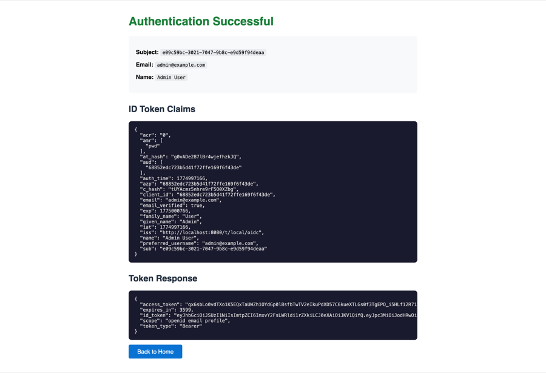

# OpenID Connect 1.0 Relying Party (Demo)

Minimal OIDC RP for testing the gateway's OpenID Connect Provider role. Pure Go stdlib — no external dependencies beyond `aws-lambda-go-api-proxy` for Lambda support.

<figure>
  
  <figcaption><em>Figure 1.</em> Successful OIDC login — the RP displays the decoded ID token JWT claims and the token response from the gateway.</figcaption>
</figure>

## What it does

Discovers the gateway's OIDC endpoints via `/.well-known/openid-configuration`, redirects the user to the authorization endpoint with PKCE (S256), exchanges the authorization code for tokens at the token endpoint, decodes the ID token JWT, and displays the claims.

## Endpoints

| Path | Description |
|------|-------------|
| `/` | Home page showing configuration and "Login with OIDC" button |
| `/login` | Generates PKCE challenge + state, redirects to authorization endpoint |
| `/callback` | Exchanges authorization code for tokens, displays decoded ID token |

## Configuration

| Environment variable | Default | Description |
|---------------------|---------|-------------|
| `GATEWAY_URL` | `http://localhost:8080` | Gateway base URL |
| `TENANT_SLUG` | `local` | Tenant slug for OIDC issuer |
| `RP_CLIENT_ID` | Auto-detected from gateway API | OIDC client ID (application ID) |
| `RP_PORT` | `8082` | HTTP listen port |
| `RP_DOMAIN` | — | Public domain (Lambda mode only, for callback URL) |

## Running locally

```bash
# From project root
make test-rp

# Or directly
cd scripts/test-rp && go run main.go
```

The RP discovers OIDC endpoints on startup. If `RP_CLIENT_ID` is not set, it queries the gateway's management API to find the first OIDC application.

## Lambda deployment

When `AWS_LAMBDA_FUNCTION_NAME` is set, the app starts in Lambda mode. OIDC discovery is deferred to the first request (lazy init) to avoid Lambda init timeout when the gateway is also cold-starting. The `RP_DOMAIN` variable is required in Lambda mode to construct the correct callback URL.
