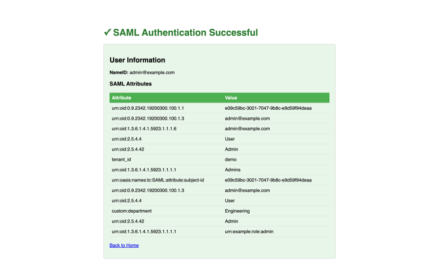

# SAML 2.0 Service Provider (Demo)

Minimal SAML SP for testing the gateway's Identity Provider role. Built with [crewjam/saml](https://github.com/crewjam/saml) v0.5 — no framework, no database, single Go file.

<figure>
  
  <figcaption><em>Figure 1.</em> Successful SAML SSO — the SP displays the authenticated user's NameID and SAML attributes received from the gateway.</figcaption>
</figure>

## What it does

Generates a SAML `AuthnRequest`, redirects the user to the gateway's SSO endpoint, receives the signed SAML assertion at its ACS URL, validates the signature against the IdP metadata, and displays the user's NameID and attributes.

## Endpoints

| Path | Description |
|------|-------------|
| `/` | Home page with "Login via SAML" button |
| `/saml/login` | Generates AuthnRequest and redirects to IdP SSO |
| `/saml/acs` | Assertion Consumer Service — receives and validates SAML Response |
| `/saml/metadata` | SP metadata (`<EntityDescriptor>`) |

## Configuration

| Environment variable | Default | Description |
|---------------------|---------|-------------|
| `SP_ENTITY_ID` | `https://test-sp.local` | SAML entity ID for this SP |
| `SP_ACS_URL` | `http://localhost:8081/saml/acs` | Assertion Consumer Service URL |
| `SP_PORT` | `8081` | HTTP listen port |
| `IDP_METADATA_URL` | `http://localhost:8080/t/local/saml/metadata` | Gateway IdP metadata URL |

## Running locally

```bash
# From project root
make test-sp

# Or directly
cd scripts/test-sp && go run main.go
```

The SP fetches IdP metadata on startup and generates a self-signed certificate for its own SAML metadata.

## Lambda deployment

When `AWS_LAMBDA_FUNCTION_NAME` is set, the app starts in Lambda mode using `aws-lambda-go-api-proxy` instead of `http.ListenAndServe`. The IdP metadata is fetched during Lambda init. The Dockerfile copies the pre-built binary into the `provided:al2023-arm64` base image.
